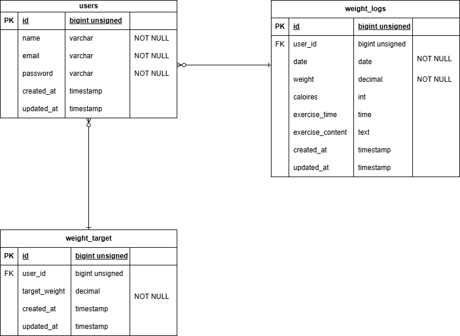

# confirm-test-pigry

## 環境構築

1. ```git clone git@github.com:ruigorou/confirm-test-mogitate.git```
2. DockerDesktopアプリを立ち上げる
3. ```docker-compose up -d --build```

## Laravel環境構築
1. ```docker-compose exec php bash```
2. ```composer install```
3. ```cp .env.example .env```
4. .envに以下の環境変数を追加 
``` 
DB_CONNECTION=mysql
DB_HOST=mysql
DB_PORT=3306
DB_DATABASE=laravel_db
DB_USERNAME=laravel_user
DB_PASSWORD=laravel_pass 
```
5. アプリケーションキーの作成 
``` 
php artisan key:generate 
``` 
6. マイグレーション実行 
```php artisan migrate```
7. シーディングの実行 
```php artisan db:seed```

## URL 
- 開発環境：http://localhost
- phpMyAdmin:：http://localhost:8080/

## 使用技術（実行環境）
- PHP 8.1.34
- Laravel 8.83.8
- MySQL 8.0.26

## ER図
